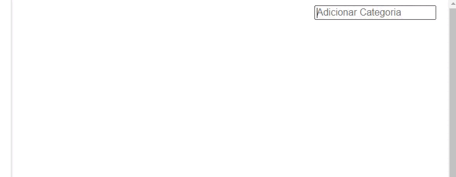
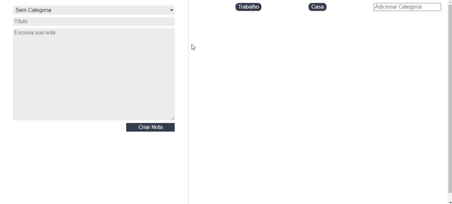
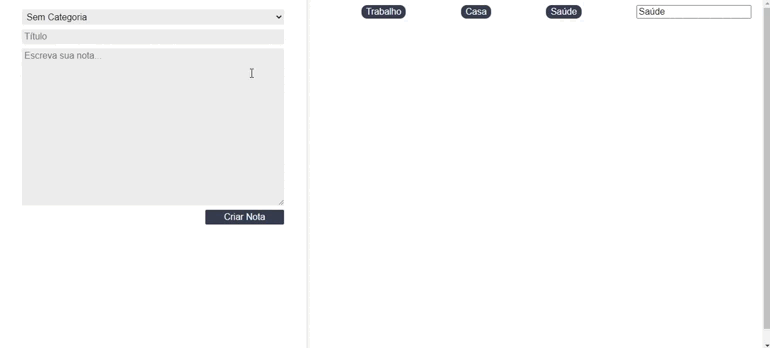

# Criador de Notas

Projeto criado no curso de React - Alura

## CEEP

### Adicione categorias para organizar as notas

### As categorias criadas são adicionadas na lista para criar notas

### É possível criar e excluir notas

